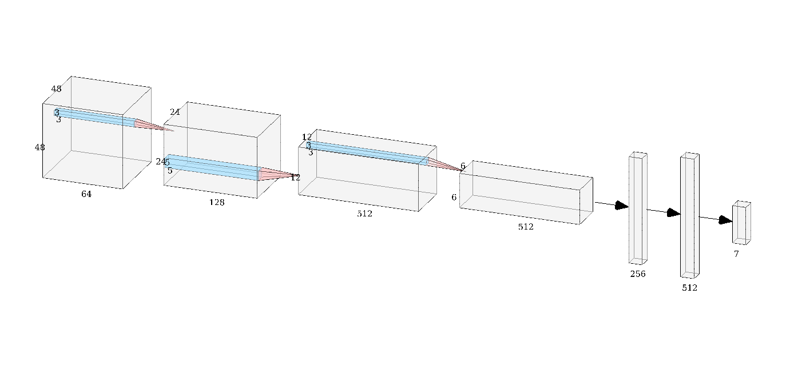

## Facial expression recognition problem ([Kaggle](https://www.kaggle.com/c/challenges-in-representation-learning-facial-expression-recognition-challenge/overview), 2013)

This is a final project for Machine Learning course at Ukrainian Catholic University. 

### The structure of the repository:

* `notebooks` - jupyter notebooks with experiments and explanations
* `scrips` - scripts written to automate the process of prediction
* `model` - saved models and their pre-trained weights
* `images` - visualizations, results and schemas
* `data` - dataset + test images

### Baseline model

Our baseline model has the following architecture:

